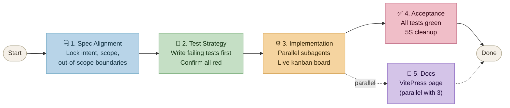

# kaizen-spec

仕様駆動・改善思想に基づくアジェンティックソフトウェア開発のための Agentic Coding スキル（`/kaizen-spec`）。

**このスキルは、自分自身の開発に使えるようになって初めて完成といえる。**

📖 **[ドキュメント](https://jackyko1991.github.io/kaizen-spec/)** · 🐙 **[GitHub](https://github.com/jackyko1991/kaizen-spec)** · 📄 **[MIT ライセンス](LICENSE)**


---

## 機能概要

`/kaizen-spec` はゲート制ワークフローを強制します。仕様が確定するまでコードを書かず、すべてのテストが通過するまで受け入れを行いません。



すべての状態は `.kaizen/`（git 管理）に永続化されるため、コンテキストをリセットしたエージェントでも任意のフェーズから再開できます。

---

## インストール

```bash
curl -fsSL https://raw.githubusercontent.com/jackyko1991/kaizen-spec/master/install.sh | bash
```

インストール後、Claude Code で任意のプロジェクトを開き、次を実行します。

```
/kaizen-spec
```

アップグレードするには、同じコマンドを再実行するだけです。

---

## 進捗の監視（かんばんボード）

`/kaizen-spec` のサイクルごとに `.kaizen/board.html` にライブかんばんボードが生成されます。サーバー環境（ローカルブラウザなし）では以下で提供できます。

```bash
make board
# → http://localhost:8080/board.html
# 別のポートを使う場合は PORT=9090 を設定
```

または Python で直接起動する場合:

```bash
cd .kaizen && python3 -m http.server 8080
```

ボードはエージェントがカードを移動するたびに 5 秒ごとに自動リロードされます。

---

## 設計思想

kaizen-spec はトヨタ生産方式（TPS）を基盤とし、Mary・Tom Poppendieck の著書『リーン・ソフトウェア開発』におけるソフトウェアへの翻訳を参照しています。トヨタの各概念は、このスキルが強制するソフトウェアプラクティスに直接対応しています。

| トヨタ / TPS | JP | ソフトウェア上の対応 | それがないと何が起きるか |
|---|---|---|---|
| ムダの排除 | 無駄 | 未出荷のコードは在庫のムダ | コードはユーザーに届く前から保守コストと陳腐化リスクを蓄積する |
| ジャスト・イン・タイム（JIT） | ジャスト・イン・タイム | CI/CD - プル型デリバリー | 大規模バッチリリースはリスクを蓄積し、欠陥が検出前に複合する |
| 自働化（ジドウカ） | 自働化 | TDD - テストがアンドンを引く | 欠陥が本番へ流れ込む。ラインを止めるセンサーがない |
| ポカヨケ（ミスよけ） | 防呆 | 静的型付け、リント、スキーマ検証 | エラーが実行時またはユーザーによって発見され、記述時点で捕捉されない |
| 改善 | 改善 | 仕様の改善 - テスト失敗を仕様にフィードバック | 仕様が現実から乖離し、エージェントが繰り返し間違った問題を解く |
| 一個流 | 一個流 | アトミック仕様 - 1 エージェント・1 タスク・1 責任 | 大きなコンテキストはエージェントの精度を下げ、長いタスクを並列化できない |
| 決定を遅らせる | - | リーン仕様 - ジャスト・イン・タイム設計 | 事前設計の仕様は実装前に陳腐化し、過剰設計が組み込まれる |
| 標準作業 | 標準作業 | 状態はエージェントのメモリではなく `.kaizen/` ファイルに保存 | コンテキストリセット後のエージェントが再開できず、ユーザーが毎回説明し直す羽目になる |

## ライセンス

**[MIT ライセンス](LICENSE)**
