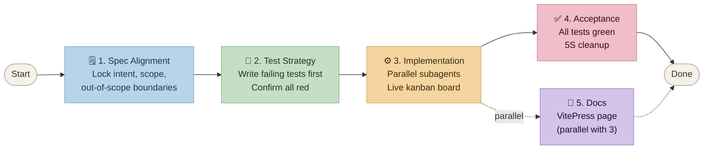

# kaizen-spec

An Agentic Coding skill (`/kaizen-spec`) for spec-driven, kaizen-informed, agentic software development.

**The skill is only done when it can be used to develop itself.**

📖 **[Documentation](https://jackyko1991.github.io/kaizen-spec/)** · 🐙 **[GitHub](https://github.com/jackyko1991/kaizen-spec)** · 📄 **[MIT License](LICENSE)**


---

## What it does

`/kaizen-spec` enforces a gated workflow — no code before spec is committed, no acceptance before all tests pass:



State is persisted in `.kaizen/` (git-tracked) so fresh-context agents can resume at any phase.

---

## Install

```bash
curl -fsSL https://raw.githubusercontent.com/jackyko1991/kaizen-spec/master/install.sh | bash
```

Then open any project in Claude Code and run:

```
/kaizen-spec
```

To upgrade, re-run the same command.

---

## Monitor progress (kanban board)

Each `/kaizen-spec` cycle generates a live kanban board at `.kaizen/board.html`. On a server (no local browser), serve it with:

```bash
make board
# → http://localhost:8080/board.html
# Set PORT=9090 to use a different port
```

Or directly with Python:

```bash
cd .kaizen && python3 -m http.server 8080
```

The board auto-reloads every 5 seconds as agents move cards.

---

## Philosophy

kaizen-spec is grounded in the Toyota Production System (TPS) as translated to software by Mary and Tom Poppendieck in *Lean Software Development*. Each Toyota concept maps directly to a software practice enforced by this skill:

| Toyota / TPS | JP | Software equivalent | What breaks without it |
|---|---|---|---|
| Muda — waste elimination | 無駄 | Unshipped code is inventory waste | Code accrues maintenance cost and obsolescence risk before it reaches users |
| Just-in-Time (JIT) | ジャスト・イン・タイム | CI/CD — pull-based delivery | Big-batch releases accumulate risk; defects compound before detection |
| Jidoka — autonomation | 自働化 | TDD — tests pull the Andon cord | Defects flow downstream into production; no sensor to stop the line |
| Poka-Yoke — mistake-proofing | 防呆 | Static typing, linting, schema validation | Errors are caught at runtime or by users instead of at the point of writing |
| Kaizen — continuous improvement | 改善 | Spec Kaizen — test failures feed back into the spec | Specs drift from reality; agents repeatedly solve the wrong problem |
| One-piece flow | 一個流 | Atomic Specs — one agent, one task, one responsibility | Large context windows reduce agent accuracy; long tasks can't be parallelised |
| Decide late | — | Lean Spec — Just-in-Time design | Big-upfront specs become stale before implementation; over-engineering is baked in |
| Standard Work | 標準作業 | State in `.kaizen/` files, not agent memory | Fresh-context agents cannot resume; users must re-explain context from scratch |

## License

**[MIT License](LICENSE)**
