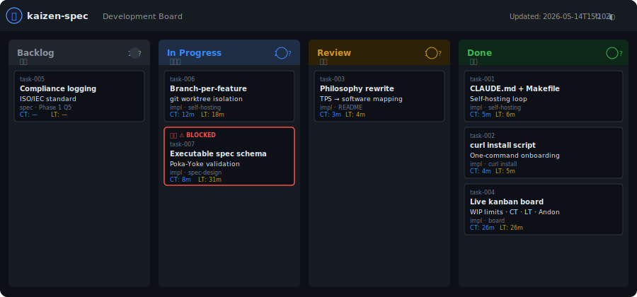
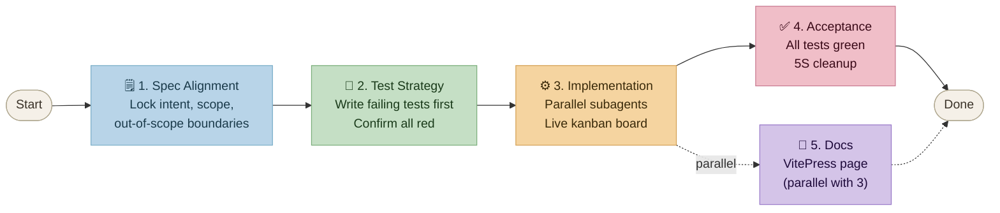

# kaizen-spec

一個 Agentic Coding 技能（`/kaizen-spec`），用於規格驅動、以改善理念為核心的智能體軟體開發。

**這個技能只有在能夠用來開發自身時，才算真正完成。**

📖 **[文件說明](https://jackyko1991.github.io/kaizen-spec/)** · 🐙 **[GitHub](https://github.com/jackyko1991/kaizen-spec)** · 📄 **[MIT 授權](LICENSE)**



---

## 功能說明

`/kaizen-spec` 強制執行分階段閘控工作流程——規格確認前不寫程式碼，所有測試通過前不進行驗收：



所有狀態都持久化於 `.kaizen/`（由 git 追蹤），因此全新上下文的智能體可以從任意階段繼續作業。

---

## 安裝

```bash
curl -fsSL https://raw.githubusercontent.com/jackyko1991/kaizen-spec/master/install.sh | bash
```

然後在 Claude Code 中開啟任意專案並執行：

```
/kaizen-spec
```

如需升級，重新執行相同指令即可。

---

## 監控進度（生產看板）

每次 `/kaizen-spec` 循環都會在 `.kaizen/board.html` 產生即時生產看板。在伺服器環境（無本地瀏覽器）中，可用以下指令提供服務：

```bash
make board
# → http://localhost:8080/board.html
# 設定 PORT=9090 可使用不同埠號
```

或直接使用 Python：

```bash
cd .kaizen && python3 -m http.server 8080
```

看板每 5 秒自動重新載入，即時反映智能體移動卡片的狀態。

---

## 設計理念

kaizen-spec 以豐田生產系統（TPS）為基礎，並援引 Mary 與 Tom Poppendieck 在《精實軟體開發》中對軟體實踐的詮釋。每個豐田概念都直接對應本技能所強制執行的軟體實踐：

| 豐田 / TPS | JP | 軟體對應實踐 | 缺少時的後果 |
|---|---|---|---|
| Muda — 消除浪費 | 無駄 | 未交付的程式碼即為庫存浪費 | 程式碼在到達使用者之前持續累積維護成本與過期風險 |
| Just-in-Time (JIT) | ジャスト・イン・タイム | CI/CD — 拉式交付 | 大批次發布累積風險；缺陷在被發現前不斷疊加 |
| Jidoka — 自働化 | 自働化 | TDD — 測試拉動「安燈」警報 | 缺陷流入生產環境；沒有感應機制能夠停線 |
| Poka-Yoke — 防錯 | 防呆 | 靜態型別、程式碼檢查、綱要驗證 | 錯誤在執行期或由使用者發現，而非在撰寫時攔截 |
| Kaizen — 持續改善 | 改善 | 規格改善——測試失敗回饋至規格 | 規格與現實脫節；智能體反覆解決錯誤的問題 |
| 單件流 | 一個流 | 原子規格——一個智能體、一個任務、一個職責 | 大上下文視窗降低智能體準確率；長任務無法平行化 |
| 延遲決策 | — | 精實規格——即時設計 | 預先設計的規格在實作前就已過時；過度工程被硬編入設計 |
| 標準作業 | 標準作業 | 狀態保存於 `.kaizen/` 檔案而非智能體記憶體 | 全新上下文的智能體無法繼續作業；使用者必須從頭重新說明背景 |

## 授權

**[MIT 授權](LICENSE)**
